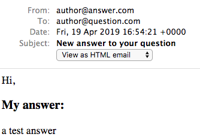

<!-- START doctoc generated TOC please keep comment here to allow auto update -->
<!-- DON'T EDIT THIS SECTION, INSTEAD RE-RUN doctoc TO UPDATE -->
**Table of Contents**  *generated with [DocToc](https://github.com/thlorenz/doctoc)*

- [Ruby on Rails 4: Getting Started](#ruby-on-rails-4-getting-started)
  - [Introduction](#introduction)
    - [Starting a Rails Project](#starting-a-rails-project)
    - [The Layout](#the-layout)
    - [Questions View](#questions-view)
    - [Answers View](#answers-view)
  - [Models and Migrations](#models-and-migrations)
    - [The Question Resource](#the-question-resource)
    - [Working with Data and Helpers](#working-with-data-and-helpers)
    - [Asking a Question](#asking-a-question)
    - [The Answer Resource](#the-answer-resource)
    - [Relationships](#relationships)
  - [Action Mailer and Active Job](#action-mailer-and-active-job)
    - [Informative UI](#informative-ui)
    - [Working with Sessions](#working-with-sessions)
    - [Test Driven Development](#test-driven-development)
    - [Email Previews](#email-previews)
    - [Active Job with Sucker Pench](#active-job-with-sucker-pench)

<!-- END doctoc generated TOC please keep comment here to allow auto update -->

# Ruby on Rails 4: Getting Started

> Learning Rails with Pluralsight [course](https://app.pluralsight.com/library/courses/ruby-rails-4-getting-started/table-of-contents)

## Introduction


- Will be building Q&A site.
- Every request goes through a cycle of Rails components
- Start with _Route_ (URL entered in browser) + HTTP Verb
- Route figures out which _Controller_ should be in charge of request and passes control to it
- Controller is responsible for preparing everything the _View_ needs to render
- View is template - how data will be communicated back to user
- Rails is very modular - lots of internal concepts that should be understood
- Default database that comes with Rails is SQLite, will be used for this course. Self-contained transactional db, very easy to use

### Starting a Rails Project

Need recent version of Ruby

```shell
$ ruby -v
ruby 2.6.0p0 (2018-12-25 revision 66547) [x86_64-darwin16]
```

Install Rails, course using 4.2.0 but some incompatibility wrt numeric types with Ruby 2.6 therefore will be using 4.2.8, see [this SO post](https://stackoverflow.com/questions/41504106/ruby-2-4-and-rails-4-stack-level-too-deep-systemstackerror) for details.

```shell
$ gem install rails -v 4.2.8
```

To view all options for starting rails project:

```shell
$ rails new -h
```

To start a new project with default settings (HU is project name for this course):

```shell
$ rails new HU
$ cd HU
$ tree
.
├── Gemfile
├── Gemfile.lock
├── README.rdoc
├── Rakefile
├── app
│   ├── assets
│   │   ├── images
│   │   ├── javascripts
│   │   │   └── application.js
│   │   └── stylesheets
│   │       └── application.css
│   ├── controllers
│   │   ├── application_controller.rb
│   │   └── concerns
│   ├── helpers
│   │   └── application_helper.rb
│   ├── mailers
│   ├── models
│   │   └── concerns
│   └── views
│       └── layouts
│           └── application.html.erb
├── bin
│   ├── bundle
│   ├── rails
│   ├── rake
│   ├── setup
│   └── spring
├── config
│   ├── application.rb
│   ├── boot.rb
│   ├── database.yml
│   ├── environment.rb
│   ├── environments
│   │   ├── development.rb
│   │   ├── production.rb
│   │   └── test.rb
│   ├── initializers
│   │   ├── assets.rb
│   │   ├── backtrace_silencers.rb
│   │   ├── cookies_serializer.rb
│   │   ├── filter_parameter_logging.rb
│   │   ├── inflections.rb
│   │   ├── mime_types.rb
│   │   ├── session_store.rb
│   │   └── wrap_parameters.rb
│   ├── locales
│   │   └── en.yml
│   ├── routes.rb
│   └── secrets.yml
├── config.ru
├── db
│   └── seeds.rb
├── lib
│   ├── assets
│   └── tasks
├── log
├── public
│   ├── 404.html
│   ├── 422.html
│   ├── 500.html
│   ├── favicon.ico
│   └── robots.txt
├── test
│   ├── controllers
│   ├── fixtures
│   ├── helpers
│   ├── integration
│   ├── mailers
│   ├── models
│   └── test_helper.rb
├── tmp
│   └── cache
│       └── assets
└── vendor
    └── assets
        ├── javascripts
        └── stylesheets
```

Start a web server for project, then navigate to [http://localhost:3000](http://localhost:3000)

```shell
$ rails server
```

Worked for instructor but I was getting error related to sqllite3, had to install older version, update Gemfile:

```ruby
# Use sqlite3 as the database for Active Record
gem 'sqlite3', '~> 1.3.13'
```

Then update deps and run server again (using shortcut this time)

```shell
$ bundle update
$ rails s
```

Note server console in terminal from navigating to root index - indicates HTTP Verb, Route and which Controller and action handled that route, in this case `/` was handled by `Rails::WelcomeController` and `index` action within that controller.

```
Started GET "/" for ::1 at 2019-04-14 15:55:30 -0400
Processing by Rails::WelcomeController#index as HTML
  Rendered /Users/someuser/.rvm/gems/ruby-2.6.0/gems/railties-4.2.8/lib/rails/templates/rails/welcome/index.html.erb (2.1ms)
Completed 200 OK in 18ms (Views: 10.1ms | ActiveRecord: 0.0ms)
```

In browser, clicking `About your application's environment` link shows some env info and server log shows route `/rails/info/properties` handled by `InfoController`, `properties` action.

```
Started GET "/rails/info/properties" for ::1 at 2019-04-14 15:59:16 -0400
Processing by Rails::InfoController#properties as */*
  Rendered /Users/someuser/.rvm/gems/ruby-2.6.0/gems/railties-4.2.8/lib/rails/templates/rails/info/properties.html.erb (0.3ms)
Completed 200 OK in 43ms (Views: 8.4ms | ActiveRecord: 5.6ms)
```

Leave server running, then open a new tab to generate a new `home` controller with a single action `index` using built-in generator

```shell
$ rails generate controller home index
/Users/someuser/.rvm/gems/ruby-2.6.0/gems/activesupport-4.2.8/lib/active_support/core_ext/object/duplicable.rb:111: warning: BigDecimal.new is deprecated; use BigDecimal() method instead.
Running via Spring preloader in process 27055
      create  app/controllers/home_controller.rb
       route  get 'home/index'
      invoke  erb
      create    app/views/home
      create    app/views/home/index.html.erb
      invoke  test_unit
      create    test/controllers/home_controller_test.rb
      invoke  helper
      create    app/helpers/home_helper.rb
      invoke    test_unit
      invoke  assets
      invoke    coffee
      create      app/assets/javascripts/home.coffee
      invoke    scss
      create      app/assets/stylesheets/home.scss
```

Now in browser, navigate to [http://localhost:3000/home/index](http://localhost:3000/home/index), get an auto generated view that looks like this:


To change it, edit [HU/app/views/home/index.html.erb](HU/app/views/home/index.html.erb). Note the view directory matches controller name `home`. Change contents of this file to:

```html
<h1>Welcome</h1>
```

Refresh browser at [http://localhost:3000/home/index](http://localhost:3000/home/index) and will see change has been applied.

To make our new home/index the default view, edit routes file [HU/config/routes.rb](HU/config/routes.rb) and add `root` entry:

```ruby
Rails.application.routes.draw do
  root 'home#index'
end
```

Can also add actions to controllers manually rather than using generator, eg: add about page, making it responsibility of home controller.

Modify `config/routes.rb`:

```ruby
Rails.application.routes.draw do
  root 'home#index'
  get '/about' => 'home#about'
end
```

Edit `HU/app/controllers/home_controller.rb` and add empty method for `about` action:

```ruby
class HomeController < ApplicationController
  # was created earlier by generator
  def index
  end

  # creating this one manually
  def about
  end
end

```

Note when action method is empty it's optional, but good practice it list it in controller regardless.

Create new view template `HU/app/views/home/about.html.erb` with contents:

```html
<h1>About us</h1>
```

Now can navigate in browser to [http://localhost:3000/about](http://localhost:3000/about)

Note that we never need to restart server during development, dev server has smart defaults and auto reloads changes.

### The Layout

- Demo project will use bootstrap via cdn
- Needs to be available on _all_ pages
- If add to any given view template, will only be available on that view
- To solve this, need Rails _Layout_ - special html erb file that's included _around_ every view, see `HU/app/views/layouts/application.html.erb`
- This file should contain headers, footers, anything that needs to be on every page in project
- Add bootstrap cdn stylsheet link at top of header, also include bootstrap js (will need for modal)
- `<%= yield %>` is where every view will be rendered
- Wrap this in bootstrap container
- Add bootstrap navbar
- Add some fake data questions to home page `HU/app/views/home/index.html.erb`

### Questions View

- Make Ask Question button (on navbar) show a modal dialog containing new question form
- Need to collect user's email address and their question
- When user submits form, redirected to home page with newly created question displayed at top of list of questions
- Use bootstrap modal component
- Since Ask Question button is available on every page (because its on nav), will add modal markup to layout file
- To make modal show when button clicked, need to define modal as target to that button

**Partial Views**

- Main layout file getting messy, pull out some markup to _partials_
- Pull out modal markup to new file `HU/app/views/home/_new_question_form.html.erb`
- Starting template name with `_` is rails convention to indicate this file is a partial
- Partials not rendered on their own, always included from another view
- To use a partial in a view, use `render` method, providing it partial name, eg: `<%= render 'home/new_question_form' %>` NOTE no underscore in name passed to render
- Also extract nav bar to partial `HU/app/views/home/_navbar.html.erb`
- Partials can be placed in any dir
- For `_new_question_form.html.erb`, make sure `<form>...</form>` tag contains input fields and submit/cancel buttons
- button should be of type submit
- Add action to form to post to `/questions` endpoint (not implemented yet)

```html
<form class="form-horizontal" action="/questions" method="POST">
  ...
</form>
```

**Define route to handle HTTP POST /questions**

Add entry to `routes.rb` as temporary handler:

```ruby
Rails.application.routes.draw do
  ...
  post '/questions' => 'home#temp'
end
```

Modify `home_controller.rb` to add temp action method:

```ruby
class HomeController < ApplicationController
  ...
  def temp
    redirect_to root_path
  end
end
```

- Testing form submission again will generate Rails error re: authenticity.
- Built-in Rails security feature: Form can only be submitted with valid `authenticity_token`
- Fix by using form helper in view instead of regular form tag, which will generate form tag _and_ include a valid authenticity token

```html
<%= form_for :question, url: '/questions', html: { class: 'form-horizontal' } do %>
  ...
<% end %>
```

Test submit question form, now it works, server log shows form post parameters including authenticity token:

```
Started POST "/questions" for ::1 at 2019-04-16 10:30:49 -0400
Processing by HomeController#temp as HTML
  Parameters: {"utf8"=>"✓", "authenticity_token"=>"Hfompyg542YoUS4lmn16q5oRCUg28ep8826F1wLW1uQuDxAT743vn9Qnpw1wNZBFSGZxmZyViM4uifuSqR7ffw==", "email"=>"a@a.a", "question_body"=>"temp"}
Redirected to http://localhost:3000/
Completed 302 Found in 1ms (ActiveRecord: 0.0ms)
```

Note that the form inputs are included only because they were provided `name` attributes in markup.

### Answers View

- Create a page for each question displaying question details, list of answers, and new answers can also be submitted on this view.
- Url will be `/questions/12` where `12` is question id

Start by defining placeholder route in `routes.rb`

```ruby
Rails.application.routes.draw do
  ...
  get '/questions/:id' => 'home#question'
end
```

Create new view `HU/app/views/home/question.html.erb`, leave it empty for now.

Now navigate to [http://localhost:3000/questions/12](http://localhost:3000/questions/12), displays an empty template, and server log shows route being handled:

```
Started GET "/questions/12" for ::1 at 2019-04-16 10:52:29 -0400
Processing by HomeController#question as HTML
  Parameters: {"id"=>"12"}
  Rendered home/question.html.erb within layouts/application (1.4ms)
  Rendered home/_navbar.html.erb (0.0ms)
  Rendered home/_new_question_form.html.erb (0.2ms)
Completed 200 OK in 28ms (Views: 27.3ms | ActiveRecord: 0.0ms)
```

- Copy a single question element from `index.html.erb` to `question.html.erb` and make it the `lead well` element.
- Display some fake answers below it

Modify `index.html.erb` so that when question is clicked, it links to `/questions/:id` route:

```html
<a href="/questions/12" class="btn btn-success btn-xs">View Answers</a>
```

- Wire up Submit New Answer button on `questions.html.erb` view so that it brings up new modal.
- Copy `_new_question_form.html.erb` to `_new_answer_form.html.erb`
- This form will post to /answers `<%= form_for :answer, url: '/answers', html: { class: 'form-horizontal' } do %>`
- Include `_new_answer_form.html.erb` partial/modal in `questions.html.erb` via `<%= render 'home/new_answer_form' %>`
- Define trigger for modal on Submit New Answer button
- Need to handle POST /answers, add entry in `routes.rb`: `post '/answers' => 'home#temp'`
- Try to submit an answer and check server log:

```
Started POST "/answers" for ::1 at 2019-04-16 12:49:05 -0400
Processing by HomeController#temp as HTML
  Parameters: {"utf8"=>"✓", "authenticity_token"=>"KA02FYjm8CaJKYgWdiG4JNe5a15d2aoVscJyfh9leEcb+AChT1L833VfAT6caVLKBc4Tj/e9yKdsJQw7tK1x3A==", "email"=>"a@a.a", "answer_body"=>"a"}
Redirected to http://localhost:3000/
Completed 302 Found in 1ms (ActiveRecord: 0.0ms)
```

## Models and Migrations

### The Question Resource

- Use a generator to generate a resource - provide name of model, then list of data fields in column:type pairs
- Resource is similar to model, but also generates REST style routes to work with model

```shell
$ rails g resource question email:string body:text
Running via Spring preloader in process 8436
  invoke  active_record
  create    db/migrate/20190416172124_create_questions.rb
  create    app/models/question.rb
  invoke    test_unit
  create      test/models/question_test.rb
  create      test/fixtures/questions.yml
```

Generator creates migration under `db/migrate`, for example `HU/db/migrate/20190416172124_create_questions.rb`, this is used to create the table in database:

```ruby
class CreateQuestions < ActiveRecord::Migration
  def change
    create_table :questions do |t|
      t.string :email
      t.text :body

      t.timestamps null: false
    end
  end
end
```

Syntax is db agnostic, works on any relational db, as long as driver is installed.

Modify generated code by specifying that fields cannot be null, if try to insert null will get error from db:

```ruby
class CreateQuestions < ActiveRecord::Migration
  def change
    create_table :questions do |t|
      t.string :email, null: false
      t.text :body, null: false

      t.timestamps null: false
    end
  end
end
```

`timestamps` field which was added by generator adds two fields to table: `created_at` and `updated_at`

To run all pending migrations

```shell
$ rake db:migrate
== 20190416172124 CreateQuestions: migrating ==================================
-- create_table(:questions)
   -> 0.0006s
== 20190416172124 CreateQuestions: migrated (0.0007s) =========================
```

- To insert some data, use rails console, similar to IRB but has all rails and project code loaded.
- Use active record methods to read and create data
- Create method accepts hash of field names and values
- Active record methods get translated to SQL statements that are sent to db

```shell
$ rails console
2.6.0 :001 > Question.count
   (0.1ms)  SELECT COUNT(*) FROM "questions"
 => 0
2.6.0 :002 > Question.create email: 'samer.buno@gmail.com', body: 'How old is the universe?'
   (0.1ms)  begin transaction
  SQL (0.4ms)  INSERT INTO "questions" ("email", "body", "created_at", "updated_at") VALUES (?, ?, ?, ?)  [["email", "samer.buno@gmail.com"], ["body", "How old is the universe?"], ["created_at", "2019-04-16 17:40:32.086945"], ["updated_at", "2019-04-16 17:40:32.086945"]]
   (1.8ms)  commit transaction
 => #<Question id: 1, email: "samer.buno@gmail.com", body: "How old is the universe?", created_at: "2019-04-16 17:40:32", updated_at: "2019-04-16 17:40:32">
2.6.0 :003 > Question.create email: 'samer.buno@gmail.com', body: 'How old is the Milky Way?'
   (0.1ms)  begin transaction
  SQL (0.2ms)  INSERT INTO "questions" ("email", "body", "created_at", "updated_at") VALUES (?, ?, ?, ?)  [["email", "samer.buno@gmail.com"], ["body", "How old is the Milky Way?"], ["created_at", "2019-04-16 17:41:14.402148"], ["updated_at", "2019-04-16 17:41:14.402148"]]
   (1.4ms)  commit transaction
 => #<Question id: 2, email: "samer.buno@gmail.com", body: "How old is the Milky Way?", created_at: "2019-04-16 17:41:14", updated_at: "2019-04-16 17:41:14">
2.6.0 :004 > Question.count
   (0.1ms)  SELECT COUNT(*) FROM "questions"
 => 2
```

Now update `index.html.erb` view with real data. Need to update email, question body and gravatar (derived from email)

View is only responsible for displaying data

Controller `home_controller.rb` is responsible for preparing data for the View, for example - it will decide if it should load in all questions or just the few most recent ones

```ruby
class HomeController < ApplicationController
  def index
    # Read in all Questions and store them in instance variable
    # By convetion, all instance variables are available in view
    @questions = Question.all
  end
end
```

Update `index.html.erb` to display data from `@questions` instance variable exposed by controller, looping over reach question, exposing a `q` variable

```html
<% @questions.each do |q| %>
<div class="media">
  <div class="media-left">
    <a href="#">
      
    </a>
  </div>
  <div class="media-body">
    <h4 class="media-heading"><%= q.email %> asked:</h4>
    <%= q.body %>
    <div>
      <a href="/questions/12" class="btn btn-success btn-xs">View Answers</a>
    </div>
  </div>
</div>
<% end %>
```

Now need to replace dummy gravatar with the real thing based on email - calculate md5 hash. This logic belongs in model. Add an instance method to Question model `HU/app/models/question.rb`

```ruby
class Question < ActiveRecord::Base
  def gravatar
    "http://www.gravatar.com/avatar/#{Digest::MD5.hexdigest(email)}"
  end
end
```

Then update gravatar url in `index.html.erb` to use new model method

```html
" />
```

To verify gravatar code is working, add one more question in rails console using a different email:

```shell
2.6.0 :021 > Question.create email: 'samer@on-site.com', body: 'How did the moon get formed?'
  (0.1ms)  begin transaction
 SQL (0.2ms)  INSERT INTO "questions" ("email", "body", "created_at", "updated_at") VALUES (?, ?, ?, ?)  [["email", "samer@on-site.com"], ["body", "How did the moon get formed?"], ["created_at", "2019-04-16 19:35:13.953675"], ["updated_at", "2019-04-16 19:35:13.953675"]]
  (1.3ms)  commit transaction
=> #<Question id: 3, email: "samer@on-site.com", body: "How did the moon get formed?", created_at: "2019-04-16 19:35:13", updated_at: "2019-04-16 19:35:13">
```

### Working with Data and Helpers

Would like to display most recent question first. To do this, update `home_controller.rb`, use `order` method which takes hash of fields to be ordered by and direction of order

```ruby
class HomeController < ApplicationController
  def index
    # Read in all Questions and store them in instance variable
    # By convetion, all instance variables are available in view
    @questions = Question.order(created_at: :desc).all
  end
end
```

Would also like to display creation date in view `index.html.erb`, modify to also show `created_at` field from question model:

```html
<h4 class="media-heading"><%= q.email %> asked:</h4>
<%= q.created_at %> <%= q.body %>
```

This displays date in default UTC view, eg: `2019-04-16 17:40:32 UTC`. Need to make this more friendly for UI display such as `5 minutes ago`, `3 hours ago`, etc. Use _Rails Helper_ to accomplish this. Rails comes with some helpers for just this purpose.

```html
<%= time_ago_in_words q.created_at %> ago
```

_Helpers_ are re-usable methods that can be used in views. In addition to built-in helpers, can write custom helpers.

### Asking a Question

Will connect ask a question UI developed earlier with db model.

Modify `routes.rb`, remove temporary routes added earlier and add new entry to expose REST endpoints for `questions` resource

```ruby
Rails.application.routes.draw do
  resources :questions
  root 'home#index'
  get '/about' => 'home#about'
end
```

Now trying to submit a question generates Unknown action error

"The action 'create' could not be found for QuestionsController"

By default, Rails expecting actions to be handled by `QuestionsController`. Add action methods in `HU/app/controllers/questions_controller.rb` (was generated earlier by resource generator)

```ruby
class QuestionsController < ApplicationController
  # handle form Post action for Question model
  def create
  end
end
```

Trying to submit question form again, now get "Template is missing" error. Because `create` action in `QuestionsController` did not render any templates.

Modify `create` method to create the Question from form parameters, then redirect to home page.

How is data currently being submitted? Check server log

```
Started POST "/questions" for ::1 at 2019-04-16 18:57:41 -0400
Processing by QuestionsController#create as HTML
  Parameters: {"utf8"=>"✓", "authenticity_token"=>"vNaLonyu1cd7gwFM57Dha/E+84n7foU3OZV0N+5/vjGPI70WuxrZPof1iGQN+AuFI0mLWFEa54XkcgpyRbe3qg==", "email"=>"a@a.a", "question_body"=>"a"}
```

Would be better if all Question data was contained in a single hash. To accomplish that, modify `_new_question_form.html.erb` to name form fields using array format

```html
<input
  type="email"
  name="question[email]"
  class="form-control"
  id="inputEmail"
  placeholder="Email"
  required
/>
<textarea
  class="form-control"
  name="question[body]"
  id="inputQuestion"
  placeholder="What would you like to know"
  required
></textarea>
```

Submit the form again and check logs, notice all question data now in a single hash

```
Started POST "/questions" for ::1 at 2019-04-16 19:05:45 -0400
Processing by QuestionsController#create as HTML
  Parameters: {"utf8"=>"✓", "authenticity_token"=>"LmM/okY8QRl0B7g6vlxxQGgACjdNFkIf37lSbZSg1TcdlgkWgYhN4IhxMRJUFJuuundy5udyIK0CXiwoP2jcrA==", "question"=>{"email"=>"a@a.a", "body"=>"a"}}
```

Now implement `create` method in `QuestionsController`. Use `params.require` to specify only the allowed parameters that can be submitted to model `create` method

```ruby
class QuestionsController < ApplicationController
  # handle form Post action for Question model
  def create
    Question.create(question_params)
    redirect_to root_path
  end

  private

  def question_params
    params.require(:question).permit(:email, :body)
  end

end
```

### The Answer Resource

Implement View Answers. Since we removed temp route, now get Unknown action error "The action 'show' could not be found for QuestionsController".

Recall `index.html.erb` has

```html
<a href="/questions/12" class="btn btn-success btn-xs">View Answers</a>
```

`show` is default action Rails uses to handle GET for a single resource.

Implement by adding `show` method in `questions_controller.rb`

```ruby
# handle GET for a single Question
def show
end
```

Move view `question.html.erb` from `views/home` to `views/questions` and rename to `show.html.erb`

Get rid of hard-coded fake `12` from questions url in `index.html.erb`, need to replace with real question id's. Use a url helper for this

```html
<a href="<%= question_path(q) %>" class="btn btn-success btn-xs"
  >View Answers</a
>
```

Implement `show` method in `questions_controller.rb`, read current question from db and expose it as instance variable so the view can read its properties and display them

```ruby
def show
  # id from url comes in as :id key of params hash
  @question = Question.find(params[:id])
end
```

Modify `show.html.erb` view to use `@question` instance var exposed by questions controller

```html
<!-- Recall gravatar method is defined on Question model -->
" />
...
<h4 class="media-heading"><%= @question.email%> asked:</h4>
<%= @question.body %>
```

Implement New Answer feature.

Since we removed temp route, submitting form yields Routing Error "No route matches [POST] /answers". Recall form is defined as

```html
<%= form_for :answer, url: '/answers', html: { class: 'form-horizontal' } do %>
  <input />
<% end %>
```

However, we don't have an `answers` resource currently. Need to add this - use generator,

Every answer will have `question_id` that references `questions` table to identify which answer belongs to which question.

```shell
$ rails g resource answer question_id:integer email:string body:text
Running via Spring preloader in process 5224
  invoke  active_record
  create    db/migrate/20190417143338_create_answers.rb
  create    app/models/answer.rb
  invoke    test_unit
  create      test/models/answer_test.rb
  create      test/fixtures/answers.yml
  invoke  controller
  create    app/controllers/answers_controller.rb
  invoke    erb
  create      app/views/answers
  invoke    test_unit
  create      test/controllers/answers_controller_test.rb
  invoke    helper
  create      app/helpers/answers_helper.rb
  invoke      test_unit
  invoke    assets
  invoke      coffee
  create        app/assets/javascripts/answers.coffee
  invoke      scss
  create        app/assets/stylesheets/answers.scss
  invoke  resource_route
  route    resources :answers
```

List all available routes - now showing questions resource and answers resource

```shell
$ rake routes
  Prefix Verb   URI Pattern                   Controller#Action
        answers GET    /answers(.:format)            answers#index
                POST   /answers(.:format)            answers#create
    new_answer GET    /answers/new(.:format)        answers#new
    edit_answer GET    /answers/:id/edit(.:format)   answers#edit
        answer GET    /answers/:id(.:format)        answers#show
                PATCH  /answers/:id(.:format)        answers#update
                PUT    /answers/:id(.:format)        answers#update
                DELETE /answers/:id(.:format)        answers#destroy
      questions GET    /questions(.:format)          questions#index
                POST   /questions(.:format)          questions#create
  new_question GET    /questions/new(.:format)      questions#new
  edit_question GET    /questions/:id/edit(.:format) questions#edit
      question GET    /questions/:id(.:format)      questions#show
                PATCH  /questions/:id(.:format)      questions#update
                PUT    /questions/:id(.:format)      questions#update
                DELETE /questions/:id(.:format)      questions#destroy
          root GET    /                             home#index
          about GET    /about(.:format)              home#about
```

Now trying to POST an answer again via UI get ActiveRecord::PendingMigrationError.

After resource is created, must run migrations, will run migration auto created by generator `HU/db/migrate/20190417143338_create_answers.rb`

```shell
$ rake db:migrate
== 20190417143338 CreateAnswers: migrating ====================================
-- create_table(:answers)
   -> 0.0013s
== 20190417143338 CreateAnswers: migrated (0.0014s) ===========================
```

Again trying to POST answer, get Unknown action error "The action create could not be found for AnswersController"

To fix this, add `create` action to newly added AnswersController (added when we generated answer resource) `HU/app/controllers/answers_controller.rb`

```ruby
class AnswersController < ApplicationController
  def create
    Answer.create()
    # will change this redirect later
    redirect_to root_path
  end

  private

  def answer_params
    params.require(:answer).permit(:question_id, :email, :body)
  end
end
```

Make sure `HU/app/views/home/_new_answer_form.html.erb` is submitting all required params in structured expected by AnswersController - Modify input names for square bracket notation

BUT what about question_id? Every answer must belong to a question, how to send question_id to controller? For now, resolve this by submitting question_id as a hidden input from answers form

```html
<input type="email" name="answer[email]" class="form-control" id="inputEmail" placeholder="Email" required>
<textarea class="form-control" name="answer[body]" id="inputAnswer" placeholder="What is your answer?" required></textarea>
<%# This is a partial of show.html.erb therefore have access to question instance variable %>
<input type="hidden" name="answer[question_id]" value="<%= @question.id %>">
```

Testing submit answer again now works. Verify data saved to db using rails console

```shell
rails c
2.6.0 :002 > Answer.all
 Answer Load (0.1ms)  SELECT "answers".* FROM "answers"
=> #<ActiveRecord::Relation [#<Answer id: 2, question_id: 4, email: "b@b.b", body: "b", created_at: "2019-04-17 15:07:23", updated_at: "2019-04-17 15:07:23">]>
```

### Relationships

AnswersController create action needs some improvements:

- Rather than redirecting to home page, should redirect to same question user was on when they submitted an answer.
- Should verify the `question_id` given as parameter actually exists before saving answer for it

**Define Relationship between Entities (Question and Answer)**

Currently have two ActiveRecord models:
1. `HU/app/models/question.rb`
2. `HU/app/models/answer.rb`

To define relationship, think first in English, eg: "A question has many answers". Modify Question model to express this:

```ruby
class Question < ActiveRecord::Base
  has_many :answers

  def gravatar
    "http://www.gravatar.com/avatar/#{Digest::MD5.hexdigest(email)}"
  end
end
```

Modify Answer model to indicate it belongs to a Question

```ruby
class Answer < ActiveRecord::Base
  belongs_to :question
end
```

Modify `HU/app/controllers/answers_controller.rb` `create` method to first find related Question. This will be held in a local, not instance variable because doesn't need to be exposed to view.

```ruby
class AnswersController < ApplicationController
  def create
    # read answer params, then read question_id from the answer param
    question = Question.find(params[:answer][:question_id])

    # Answer.create(answer_params)
    question.answers.create(answer_params)

    # rails will figure out what url to use to redirect to page that displays the question
    redirect_to question
  end

  private

  def answer_params
    # Don't need question_id in required params when using question.answers.create rather than Answer.create
    # params.require(:answer).permit(:question_id, :email, :body)
    params.require(:answer).permit(:email, :body)
  end
end
```

Submit answer again and check logs:

1. Answer is posted with parameters
2. Corresponding question is retrieved from db
3. New answer is inserted into db
4. After db operations complete, user redirected to corresponding question view

```
Started POST "/answers" for ::1 at 2019-04-17 12:39:35 -0400
Processing by AnswersController#create as HTML
  Parameters: {"utf8"=>"✓", "authenticity_token"=>"hupAIHSI+RX4MEXOv8sXv2EU1rLUMxfU5/AB+QT+kwjUxmRY7rcjruuY1IbhWjqjn47TGzZemP1blf2nYWllfQ==", "answer"=>{"question_id"=>"4", "email"=>"d@d.d", "body"=>"testd"}}
  Question Load (0.1ms)  SELECT  "questions".* FROM "questions" WHERE "questions"."id" = ? LIMIT 1  [["id", 4]]
Unpermitted parameter: question_id
   (0.2ms)  begin transaction
  SQL (0.5ms)  INSERT INTO "answers" ("email", "body", "question_id", "created_at", "updated_at") VALUES (?, ?, ?, ?, ?)  [["email", "d@d.d"], ["body", "testd"], ["question_id", 4], ["created_at", "2019-04-17 16:39:35.342928"], ["updated_at", "2019-04-17 16:39:35.342928"]]
   (2.8ms)  commit transaction
Redirected to http://localhost:3000/questions/4
Completed 302 Found in 42ms (ActiveRecord: 4.4ms)
```

Replace fake data answers with real question answers.

Modify `HU/app/views/questions/show.html.erb`, remove all but one mockup answers.

Surround the one remaining answer markup with a loop over `@question.answers`, exposing a local `answer` variable

```html
<% @question.answers.each do |answer| %>
  <div class="media">
    <div class="media-left">
      <a href="#">
        ">
      </a>
    </div>
    <div class="media-body">
      <h4 class="media-heading"><%= answer.email %>answered:</h4>
      <%= answer.body %>
    </div>
  </div>
<% end %>
```

Issue: There is no `gravatar` method on `Answer` model (it's on `Question` model), implementation is the same, for now copy it.

```ruby
class Answer < ActiveRecord::Base
  belongs_to :question

  def gravatar
    "http://www.gravatar.com/avatar/#{Digest::MD5.hexdigest(email)}"
  end
end
```

Modify answer list to show most recent first. Do this in `questions_controller.rb` (recall list of answers in `show.html.erb`) comes from `Questions`, `answers` relationship.

Expose new instance variable `@answers`

```ruby
class QuestionsController < ApplicationController
  def show
    @question = Question.find(params[:id])
    @answers = @question.answers.order(created_at: :desc)
  end

  # ...
end
```

Modify `show.html.erb` view to iterate over `@answers` instance variable. Also modify it to display time for each answer.

```html
<% @answers.each do |answer| %>
  <div class="media">
    <div class="media-left">
      <a href="#">
        ">
      </a>
    </div>
    <div class="media-body">
      <h4 class="media-heading"><%= answer.email %> answered:</h4>
      <%= time_ago_in_words answer.created_at %> ago
      <br>
      <%= answer.body %>
    </div>
  </div>
<% end %>
```

How to avoid repeating `gravatar` method in both `Question` and `Answer` models?

Solution - extract `gravatar` method to a module and put it in `models/concerns`

```ruby
# HU/app/models/concerns/has_gravatar.rb
module HasGravatar
  def gravatar
    "http://www.gravatar.com/avatar/#{Digest::MD5.hexdigest(email)}"
  end
end
```

Modify Question and Answer modelsl to include new module and remove gravatar method:

```ruby
class Question < ActiveRecord::Base
  include HasGravatar
  has_many :answers
end

class Answer < ActiveRecord::Base
  include HasGravatar
  belongs_to :question
end
```

## Action Mailer and Active Job

### Informative UI

Rails console provides access to all application objects, can also modify, eg delete all

```shell
$ rails console
2.6.0 :001 > Answer.count
   (0.1ms)  SELECT COUNT(*) FROM "answers"
 => 6
2.6.0 :002 > Question.count
   (0.3ms)  SELECT COUNT(*) FROM "questions"
 => 4
2.6.0 :003 > Answer.delete
Answer.delete      Answer.delete_all
2.6.0 :003 > Answer.delete
Answer.delete      Answer.delete_all
2.6.0 :003 > Answer.delete_all
  SQL (2.1ms)  DELETE FROM "answers"
 => 6
2.6.0 :004 > Question.delete_all
  SQL (1.5ms)  DELETE FROM "questions"
 => 4
```

Now look at app with no data - shows just a blank screen. Need to inform user there are no questions currently.

Question listing is in `home/index.html.erb`. Modify to check if questions is empty and show a message. `@questions` is an array so can invoke array methods on it like `empty?`

```html
<% if @questions.empty? %>
  <div class="alert alert-info">Nothing here yet, be the first to ask?</div>
<% end %>
```

Also show a message in `show.html.erb` when question has no answers yet

```html
<% if @answers.empty? %>
  <div class="alert alert-info">No answers have been posted yet.</div>
<% end %>
```

### Working with Sessions

Currently, user has to keep filling in their email every time to ask new question or post an answer.

Real app would have user authentication system, but for this, will use server side session, maintained with browser cookie.

First make server remember email user sent. Modify `questions_controller.rb`. In `create` method, email is available in `question_params[:email]`. Save this in `session` object

```ruby
class QuestionsController < ApplicationController
  # ...
  def create
    Question.create(question_params)
    session[:current_user_email] = question_params[:email]
    redirect_to root_path
  end
  # ...
end
```

Also save email when answer is submitted

```ruby
class AnswersController < ApplicationController
  def create
    question = Question.find(params[:answer][:question_id])
    question.answers.create(answer_params)
    session[:current_user_email] = answer_params[:email]
    redirect_to question
  end
  # ...
end
```

Temporarily debug if session email is being saved, modify `HU/app/views/layouts/application.html.erb` to display it

```html
<div class="well"><%= session[:current_user_email] || 'No email is saved' %></div>
```

Need to modify question and answer form views to read stored email from session.

BUT not good practice to reference session directly in views because that's an implementation detail, eg: in the future may switch to auth system, then would have to modify view to read current email from somewhere else.

For views - should abstract values being read - do this with Rails Helpers.

Instead of referencing session in views, reference a helper (doesn't exist yet)

```html
<div class="some-class"><%= current_user_email %></div>
```

Create method `current_user_email` in `HU/app/helpers/application_helper.rb`

```ruby
module ApplicationHelper
  def current_user_email
    session[:current_user_email]
  end
end
```

Now want to use this helper method in email field of forms. If there were lots of forms to be modified, use `git grep` to search in committed files using regex. This omits git ignored files like logs etc.

```shell
$ git grep input.*email
app/views/home/_new_answer_form.html.erb:              <input type="email" name="answer[email]" class="form-control" id="inputEmail" placeholder="Email" required>
app/views/home/_new_question_form.html.erb:              <input type="email" name="question[email]" class="form-control" id="inputEmail" placeholder="Email" required>
```

This tells us need to modify `_new_answer_form.html.erb` and `app/views/home/_new_question_form.html.erb`

```html
<!-- _new_answer_form.html.erb -->
<input type="email" name="answer[email]" class="form-control" id="inputEmail" placeholder="Email" required value="<%= current_user_email %>">

<!-- app/views/home/_new_question_form.html.erb -->
<input type="email" name="question[email]" class="form-control" id="inputEmail" placeholder="Email" required value="<%= current_user_email %>">
```

Finally, display current user email in `_navbar.html`

```html
<div class="navbar-text"><%= current_user_email || 'No email is saved' %></div>
```
### Test Driven Development

Feature: Send question author email notifying them when a new answer has been posted.

Use *ActionMailer* - similar to Controller but controls emails rather than views.

Generate new mailer with generator `mailer` option, given it mailer name followed by list of methods for each email to be sent

```shell
$ rails g mailer main_mailer notify_question_author
Running via Spring preloader in process 14081
  create  app/mailers/main_mailer.rb
  create  app/mailers/application_mailer.rb
  invoke  erb
  create    app/views/main_mailer
  create    app/views/layouts/mailer.text.erb
  create    app/views/layouts/mailer.html.erb
  create    app/views/main_mailer/notify_question_author.text.erb
  create    app/views/main_mailer/notify_question_author.html.erb
  invoke  test_unit
  create    test/mailers/main_mailer_test.rb
  create    test/mailers/previews/main_mailer_preview.rb
```

- `main_mailer.rb` is where email will be prepared
- `app/views` is the view for the email
- also generated test files

Given `HU/app/mailers/main_mailer.rb`, generated passing test `HU/test/mailers/main_mailer_test.rb`. To run tests

```shell
$ rake test
```

TDD approach - implement `main_mailer_test.rb` for how email should look

```ruby
require 'test_helper'

class MainMailerTest < ActionMailer::TestCase
  test "notify_question_author" do
    mail = MainMailer.notify_question_author
    assert_equal "New answer to your question", mail.subject # causes test to fail because code is using default subject
    assert_equal ["to@example.org"], mail.to
    assert_equal ["from@example.com"], mail.from
    assert_match "Hi", mail.body.encoded
  end
end
```

Recommend to use language file for implementing email rather than hard-coding condent in rb file, supports i18n `HU/config/locales/en.yml`

```yml
en:
hello: 'Hello world'

main_mailer:
  notify_question_author:
    subject: 'New answer to your question'
```

Run the tests again - should pass now.

Continuing with TDD... Receiver of email should be author of question, but `email` object doesn't have reference to question or answer.

To fix this, pass in `answer` object to mailer. To do this need test data - need to create example question and answer for test.

*fixtures* can be used to create data in yml format or can create data right in the test.

```ruby
# HU/test/mailers/main_mailer_test.rb
require 'test_helper'

class MainMailerTest < ActionMailer::TestCase
  test "notify_question_author" do
    # Generate some data for test
    question = Question.create email: 'author@question.com', body: 'a test question'
    answer = Answer.create email: 'author@answer.com', body: 'a test answer'
    # Associate answer with question by appending it to answers relation on question
    question.answers << answer

    mail = MainMailer.notify_question_author(answer)

    assert_equal "New answer to your question", mail.subject
    assert_equal [question.email], mail.to
    assert_equal [answer.email], mail.from
    assert_match "Hi", mail.body.encoded
  end
end
```

To fix, update `main_mailer.rb` notify method to accept an `answer` argument, then use it for setting mail to/from

```ruby
class MainMailer < ApplicationMailer

  # Subject can be set in your I18n file at config/locales/en.yml
  # with the following lookup:
  #
  #   en.main_mailer.notify_question_author.subject
  #
  def notify_question_author(answer)
    @greeting = "Hi"

    mail to: answer.question.email, from: answer.email
  end
end
```

Finally, ensure answer body is included in email

```ruby
require 'test_helper'

class MainMailerTest < ActionMailer::TestCase
  test "notify_question_author" do
    # Generate some data for test
    question = Question.create email: 'author@question.com', body: 'a test question'
    answer = Answer.create email: 'author@answer.com', body: 'a test answer'
    # Associate answer with question by appending it to answers relation on question
    question.answers << answer

    mail = MainMailer.notify_question_author(answer)

    assert_equal "New answer to your question", mail.subject
    assert_equal [question.email], mail.to
    assert_equal [answer.email], mail.from
    assert_match answer.body, mail.body.encoded
  end

end
```

And fix code so test passes in view associated with main mailer `HU/app/views/main_mailer/notify_question_author.text.erb`. However, the view can only access instance variables exposed in `main_mailer.rb`

```ruby
# main_mailer.rb
def notify_question_author(answer)
  @greeting = "Hi"
  @answer = answer

  mail to: answer.question.email, from: answer.email
end

# notify_question_author.text.erb
<%= @greeting %>,
My answer:
<%= @answer.body %>
```

Now test passes.

### Email Previews

Modify `AnswersController` `create` method to request MainMailer to send the email, passing in the `answer` object that was just created.

`MainMailer.notify_question_author(answer)` prepares email, `deliver_now` sends it immediately.

To test, note that in Rails dev env, emails don't get sent but can be seen in logs

```
MainMailer#notify_question_author: processed outbound mail in 213.5ms

Sent mail to a@a.a (8.8ms)
Date: Fri, 19 Apr 2019 12:44:10 -0400
From: d@d.d
To: a@a.a
Message-ID: <5cb9fada9698b_ef03fc23a0822301396b@Danielas-Mac-mini.local.mail>
Subject: New answer to your question
Mime-Version: 1.0
Content-Type: multipart/alternative;
 boundary="--==_mimepart_5cb9fada94e83_ef03fc23a0822301381";
 charset=UTF-8
Content-Transfer-Encoding: 7bit


----==_mimepart_5cb9fada94e83_ef03fc23a0822301381
Content-Type: text/plain;
 charset=UTF-8
Content-Transfer-Encoding: 7bit

Hi,
My answer:
whatever


----==_mimepart_5cb9fada94e83_ef03fc23a0822301381
Content-Type: text/html;
 charset=UTF-8
Content-Transfer-Encoding: 7bit

<html>
  <body>
    <h1>MainMailer#notify_question_author</h1>

<p>
  Hi, find me in app/views/main_mailer/notify_question_author.html.erb
</p>

  </body>
</html>

----==_mimepart_5cb9fada94e83_ef03fc23a0822301381--
```

Note HTML email template was not modified, still showing default values. Modify `HU/app/views/main_mailer/notify_question_author.html.erb`

```ruby
<%= @greeting %>,
<h3>My answer:</h3>
<p>
  <%= @answer.body %>
</p>
```

If test again, will show in log but for html, need to see in browser. Use *Mail Preview* feature.

See `HU/test/mailers/previews/main_mailer_preview.rb` that was generated earlier, shows link to use to preview email in browser

```ruby
# Preview all emails at http://localhost:3000/rails/mailers/main_mailer
class MainMailerPreview < ActionMailer::Preview

  # Preview this email at http://localhost:3000/rails/mailers/main_mailer/notify_question_author
  def notify_question_author
    MainMailer.notify_question_author
  end

end
```

Can't use as is because we modified email. Bring over test data from `main_mailer_test.rb`:

```ruby
# Preview all emails at http://localhost:3000/rails/mailers/main_mailer
class MainMailerPreview < ActionMailer::Preview

  # Preview this email at http://localhost:3000/rails/mailers/main_mailer/notify_question_author
  def notify_question_author
    # Generate some data for test
    question = Question.create email: 'author@question.com', body: 'a test question'
    answer = Answer.create email: 'author@answer.com', body: 'a test answer'

    # Associate answer with question by appending it to answers relation on question
    question.answers << answer

    # Generate email
    MainMailer.notify_question_author(answer)
  end

end
```

Then open browser at [http://localhost:3000/rails/mailers/main_mailer/notify_question_author](http://localhost:3000/rails/mailers/main_mailer/notify_question_author)



**ISSUE: POLLUTING DEVELOPMENT DATABASE WITH TEST DATA**

Every time hit email preview link, it runs the test which generates a new Question and Answer, which gets saved in development database.

To avoid this, use first Answer that happens to be in database

### Active Job with Sucker Pench

`deliver_now` sends email in same process that is serving the web page. Bad for performance, if email sending code is slow, blocks thread.

Simulate slow mailer with `sleep` method:

```ruby
class MainMailer < ApplicationMailer

  # Subject can be set in your I18n file at config/locales/en.yml
  # with the following lookup:
  #
  #   en.main_mailer.notify_question_author.subject
  #
  def notify_question_author(answer)
    # simulate slow mailer
    sleep 5 # 5 seconds
    @greeting = "Hi"
    @answer = answer

    mail to: answer.question.email, from: answer.email
  end
end
```

Trying to submit answer now - have to wait 5 seconds for control to return to browser.

Solution is to use `deliver_later`, which uses *ActiveJob* to deliver email with background processing library. Then user using web UI doesn't need to wait for email sending to complete.

```ruby
class AnswersController < ApplicationController
  def create
    question = Question.find(params[:answer][:question_id])
    answer = question.answers.create(answer_params)
    MainMailer.notify_question_author(answer).deliver_later # BACKGROUND PROCESSING
    session[:current_user_email] = answer_params[:email]
    redirect_to question
  end

  private

  def answer_params
    params.require(:answer).permit(:email, :body)
  end
end
```

However, above won't work yet, need to use an ActiveJob adapter. For this course, will use [sucker_punch](https://github.com/brandonhilkert/sucker_punch). See [Active Job](https://github.com/brandonhilkert/sucker_punch/blob/b84b7f8499d6356e4e0c755730499a21a2319f1e/README.md#active-job)

Add it to `Gemfile`, follow readme instructions to configure, kKill server and run `bundle` to install new gem, then restart server.

Now posting new answer returns control immediately to browser, and scanning server logs, 5 seconds later email gets sent.
