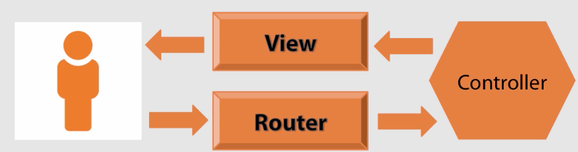
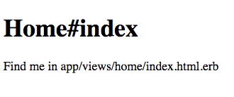

# Ruby on Rails 4: Getting Started

> Learning Rails with Pluralsight [course](https://app.pluralsight.com/library/courses/ruby-rails-4-getting-started/table-of-contents)

## Introduction



- Will be building Q&A site.
- Every request goes through a cycle of Rails components
- Start with *Route* (URL entered in browser) + HTTP Verb
- Route figures out which *Controller* should be in charge of request and passes control to it
- Controller is responsible for preparing everything the *View* needs to render
- View is template - how data will be communicated back to user
- Rails is very modular - lots of internal concepts that should be understood
- Default database that comes with Rails is SQLite, will be used for this course. Self-contained transactional db, very easy to use

### Starting a Rails Project

Need recent version of Ruby

```shell
$ ruby -v
ruby 2.6.0p0 (2018-12-25 revision 66547) [x86_64-darwin16]
```

Install Rails, course using 4.2.0 but some incompatibility wrt numeric types with Ruby 2.6 therefore will be using 4.2.8, see [this SO post](https://stackoverflow.com/questions/41504106/ruby-2-4-and-rails-4-stack-level-too-deep-systemstackerror) for details.

```shell
$ gem install rails -v 4.2.8
```

To view all options for starting rails project:

```shell
$ rails new -h
```

To start a new project with default settings (HU is project name for this course):

```shell
$ rails new HU
$ cd HU
$ tree
.
├── Gemfile
├── Gemfile.lock
├── README.rdoc
├── Rakefile
├── app
│   ├── assets
│   │   ├── images
│   │   ├── javascripts
│   │   │   └── application.js
│   │   └── stylesheets
│   │       └── application.css
│   ├── controllers
│   │   ├── application_controller.rb
│   │   └── concerns
│   ├── helpers
│   │   └── application_helper.rb
│   ├── mailers
│   ├── models
│   │   └── concerns
│   └── views
│       └── layouts
│           └── application.html.erb
├── bin
│   ├── bundle
│   ├── rails
│   ├── rake
│   ├── setup
│   └── spring
├── config
│   ├── application.rb
│   ├── boot.rb
│   ├── database.yml
│   ├── environment.rb
│   ├── environments
│   │   ├── development.rb
│   │   ├── production.rb
│   │   └── test.rb
│   ├── initializers
│   │   ├── assets.rb
│   │   ├── backtrace_silencers.rb
│   │   ├── cookies_serializer.rb
│   │   ├── filter_parameter_logging.rb
│   │   ├── inflections.rb
│   │   ├── mime_types.rb
│   │   ├── session_store.rb
│   │   └── wrap_parameters.rb
│   ├── locales
│   │   └── en.yml
│   ├── routes.rb
│   └── secrets.yml
├── config.ru
├── db
│   └── seeds.rb
├── lib
│   ├── assets
│   └── tasks
├── log
├── public
│   ├── 404.html
│   ├── 422.html
│   ├── 500.html
│   ├── favicon.ico
│   └── robots.txt
├── test
│   ├── controllers
│   ├── fixtures
│   ├── helpers
│   ├── integration
│   ├── mailers
│   ├── models
│   └── test_helper.rb
├── tmp
│   └── cache
│       └── assets
└── vendor
    └── assets
        ├── javascripts
        └── stylesheets
```

Start a web server for project, then navigate to [http://localhost:3000](http://localhost:3000)

```shell
$ rails server
```

Worked for instructor but I was getting error related to sqllite3, had to install older version, update Gemfile:

```ruby
# Use sqlite3 as the database for Active Record
gem 'sqlite3', '~> 1.3.13'
```

Then update deps and run server again (using shortcut this time)

```shell
$ bundle update
$ rails s
```

Note server console in terminal from navigating to root index - indicates HTTP Verb, Route and which Controller and action handled that route, in this case `/` was handled by `Rails::WelcomeController` and `index` action within that controller.

```
Started GET "/" for ::1 at 2019-04-14 15:55:30 -0400
Processing by Rails::WelcomeController#index as HTML
  Rendered /Users/someuser/.rvm/gems/ruby-2.6.0/gems/railties-4.2.8/lib/rails/templates/rails/welcome/index.html.erb (2.1ms)
Completed 200 OK in 18ms (Views: 10.1ms | ActiveRecord: 0.0ms)
```

In browser, clicking `About your application's environment` link shows some env info and server log shows route `/rails/info/properties` handled by `InfoController`, `properties` action.

```
Started GET "/rails/info/properties" for ::1 at 2019-04-14 15:59:16 -0400
Processing by Rails::InfoController#properties as */*
  Rendered /Users/someuser/.rvm/gems/ruby-2.6.0/gems/railties-4.2.8/lib/rails/templates/rails/info/properties.html.erb (0.3ms)
Completed 200 OK in 43ms (Views: 8.4ms | ActiveRecord: 5.6ms)
```

Leave server running, then open a new tab to generate a new `home` controller with a single action `index` using built-in generator

```shell
$ rails generate controller home index
/Users/someuser/.rvm/gems/ruby-2.6.0/gems/activesupport-4.2.8/lib/active_support/core_ext/object/duplicable.rb:111: warning: BigDecimal.new is deprecated; use BigDecimal() method instead.
Running via Spring preloader in process 27055
      create  app/controllers/home_controller.rb
       route  get 'home/index'
      invoke  erb
      create    app/views/home
      create    app/views/home/index.html.erb
      invoke  test_unit
      create    test/controllers/home_controller_test.rb
      invoke  helper
      create    app/helpers/home_helper.rb
      invoke    test_unit
      invoke  assets
      invoke    coffee
      create      app/assets/javascripts/home.coffee
      invoke    scss
      create      app/assets/stylesheets/home.scss
```

Now in browser, navigate to [http://localhost:3000/home/index](http://localhost:3000/home/index), get an auto generated view that looks like this:



To change it, edit [HU/app/views/home/index.html.erb](HU/app/views/home/index.html.erb). Note the view directory matches controller name `home`. Change contents of this file to:

```html
<h1>Welcome</h1>
```

Refresh browser at [http://localhost:3000/home/index](http://localhost:3000/home/index) and will see change has been applied.

To make our new home/index the default view, edit routes file [HU/config/routes.rb](HU/config/routes.rb) and add `root` entry:

```ruby
Rails.application.routes.draw do
  root 'home#index'
end
```

Can also add actions to controllers manually rather than using generator, eg: add about page, making it responsibility of home controller.

Modify `config/routes.rb`:

```ruby
Rails.application.routes.draw do
  root 'home#index'
  get '/about' => 'home#about'
end
```

Edit `HU/app/controllers/home_controller.rb` and add empty method for `about` action:

```ruby
class HomeController < ApplicationController
  # was created earlier by generator
  def index
  end

  # creating this one manually
  def about
  end
end

```

Note when action method is empty it's optional, but good practice it list it in controller regardless.

Create new view template `HU/app/views/home/about.html.erb` with contents:

```html
 <h1>About us</h1>
```

Now can navigate in browser to [http://localhost:3000/about](http://localhost:3000/about)

Note that we never need to restart server during development, dev server has smart defaults and auto reloads changes.

### The Layout

- Demo project will use bootstrap via cdn
- Needs to be available on *all* pages
- If add to any given view template, will only be available on that view
- To solve this, need Rails *Layout* - special html erb file that's included *around* every view, see `HU/app/views/layouts/application.html.erb`
- This file should contain headers, footers, anything that needs to be on every page in project
- Add bootstrap cdn stylsheet link at top of header, also include bootstrap js (will need for modal)
- `<%= yield %>` is where every view will be rendered
- Wrap this in bootstrap container
- Add bootstrap navbar
- Add some fake data questions to home page `HU/app/views/home/index.html.erb`

### Questions View

- Make Ask Question button (on navbar) show a modal dialog containing new question form
- Need to collect user's email address and their question
- When user submits form, redirected to home page with newly created question displayed at top of list of questions
- Use bootstrap modal component
- Since Ask Question button is available on every page (because its on nav), will add modal markup to layout file
- To make modal show when button clicked, need to define modal as target to that button

**Partial Views**

- Main layout file getting messy, pull out some markup to *partials*
- Pull out modal markup to new file `HU/app/views/home/_new_question_form.html.erb`
- Starting template name with `_` is rails convention to indicate this file is a partial
- Partials not rendered on their own, always included from another view
- To use a partial in a view, use `render` method, providing it partial name, eg: `<%= render 'home/new_question_form' %>` NOTE no underscore in name passed to render
- Also extract nav bar to partial `HU/app/views/home/_navbar.html.erb`
- Partials can be placed in any dir
- For `_new_question_form.html.erb`, make sure `<form>...</form>` tag contains input fields and submit/cancel buttons
- button should be of type submit
- Add action to form to post to `/questions` endpoint (not implemented yet)

```html
<form class="form-horizontal" action="/questions" method="POST">
  ...
</form>
```

**Define route to handle HTTP POST /questions**

Add entry to `routes.rb` as temporary handler:

```ruby
Rails.application.routes.draw do
  ...
  post '/questions' => 'home#temp'
end
```

Modify `home_controller.rb` to add temp action method:

```ruby
class HomeController < ApplicationController
  ...
  def temp
    redirect_to root_path
  end
end
```

- Testing form submission again will generate Rails error re: authenticity.
- Built-in Rails security feature: Form can only be submitted with valid `authenticity_token`
- Fix by using form helper in view instead of regular form tag, which will generate form tag *and* include a valid authenticity token

```html
<%= form_for :question, url: '/questions', html: { class: 'form-horizontal' } do %>
  ...
<% end %>
```

Test submit question form, now it works, server log shows form post parameters including authenticity token:

```
Started POST "/questions" for ::1 at 2019-04-16 10:30:49 -0400
Processing by HomeController#temp as HTML
  Parameters: {"utf8"=>"✓", "authenticity_token"=>"Hfompyg542YoUS4lmn16q5oRCUg28ep8826F1wLW1uQuDxAT743vn9Qnpw1wNZBFSGZxmZyViM4uifuSqR7ffw==", "email"=>"a@a.a", "question_body"=>"temp"}
Redirected to http://localhost:3000/
Completed 302 Found in 1ms (ActiveRecord: 0.0ms)
```

Note that the form inputs are included only because they were provided `name` attributes in markup.

### Answers View

- Create a page for each question displaying question details, list of answers, and new answers can also be submitted on this view.
- Url will be `/questions/12` where `12` is question id

Start by defining placeholder route in `routes.rb`

```ruby
Rails.application.routes.draw do
  ...
  get '/questions/:id' => 'home#question'
end
```

Create new view `HU/app/views/home/question.html.erb`, leave it empty for now.

Now navigate to [http://localhost:3000/questions/12](http://localhost:3000/questions/12), displays an empty template, and server log shows route being handled:

```
Started GET "/questions/12" for ::1 at 2019-04-16 10:52:29 -0400
Processing by HomeController#question as HTML
  Parameters: {"id"=>"12"}
  Rendered home/question.html.erb within layouts/application (1.4ms)
  Rendered home/_navbar.html.erb (0.0ms)
  Rendered home/_new_question_form.html.erb (0.2ms)
Completed 200 OK in 28ms (Views: 27.3ms | ActiveRecord: 0.0ms)
```

- Copy a single question element from `index.html.erb` to `question.html.erb` and make it the `lead well` element.
- Display some fake answers below it

Modify `index.html.erb` so that when question is clicked, it links to `/questions/:id` route:

```html
<a href="/questions/12" class="btn btn-success btn-xs">View Answers</a>
```

- Wire up Submit New Answer button on `questions.html.erb` view so that it brings up new modal.
- Copy `_new_question_form.html.erb` to `_new_answer_form.html.erb`
- This form will post to /answers `<%= form_for :answer, url: '/answers', html: { class: 'form-horizontal' } do %>`
- Include `_new_answer_form.html.erb` partial/modal in `questions.html.erb` via `<%= render 'home/new_answer_form' %>`
- Define trigger for modal on Submit New Answer button
- Need to handle POST /answers, add entry in `routes.rb`: `post '/answers' => 'home#temp'`
- Try to submit an answer and check server log:

```
Started POST "/answers" for ::1 at 2019-04-16 12:49:05 -0400
Processing by HomeController#temp as HTML
  Parameters: {"utf8"=>"✓", "authenticity_token"=>"KA02FYjm8CaJKYgWdiG4JNe5a15d2aoVscJyfh9leEcb+AChT1L833VfAT6caVLKBc4Tj/e9yKdsJQw7tK1x3A==", "email"=>"a@a.a", "answer_body"=>"a"}
Redirected to http://localhost:3000/
Completed 302 Found in 1ms (ActiveRecord: 0.0ms)
```

## Models and Migrations

### The Question Resource